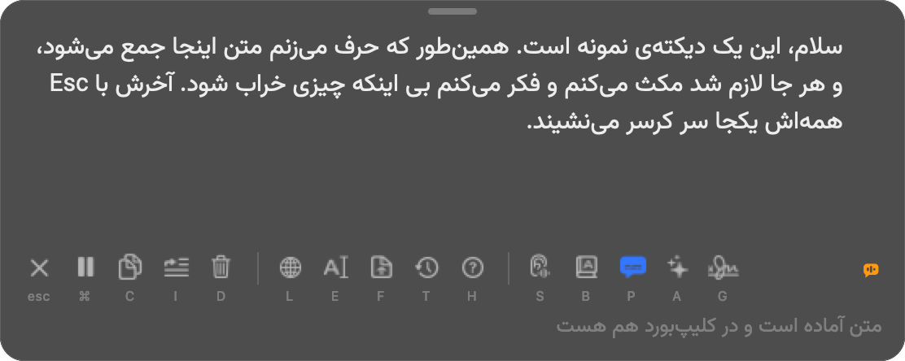
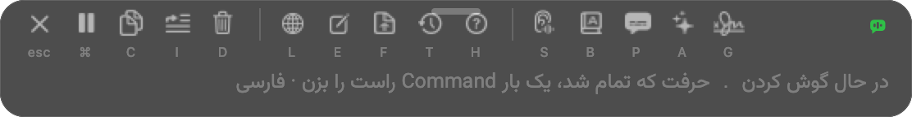
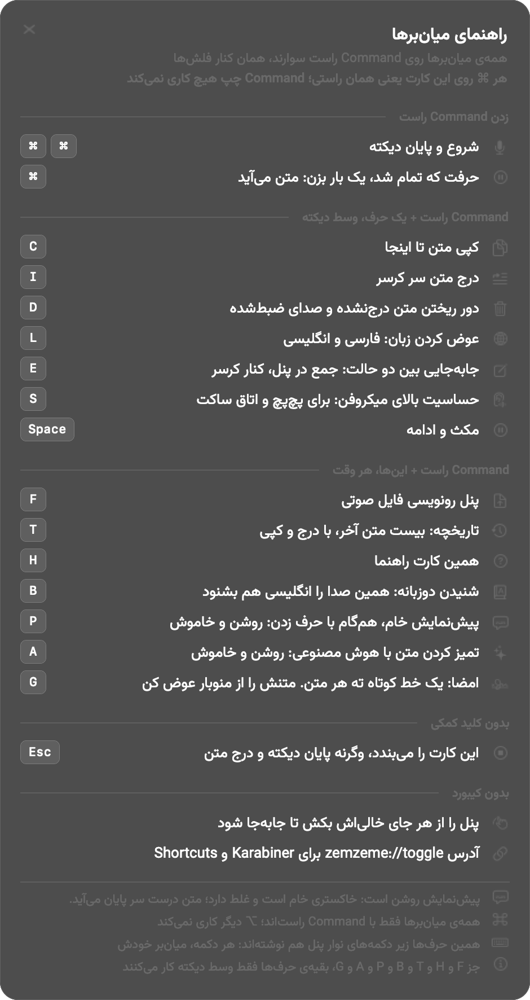
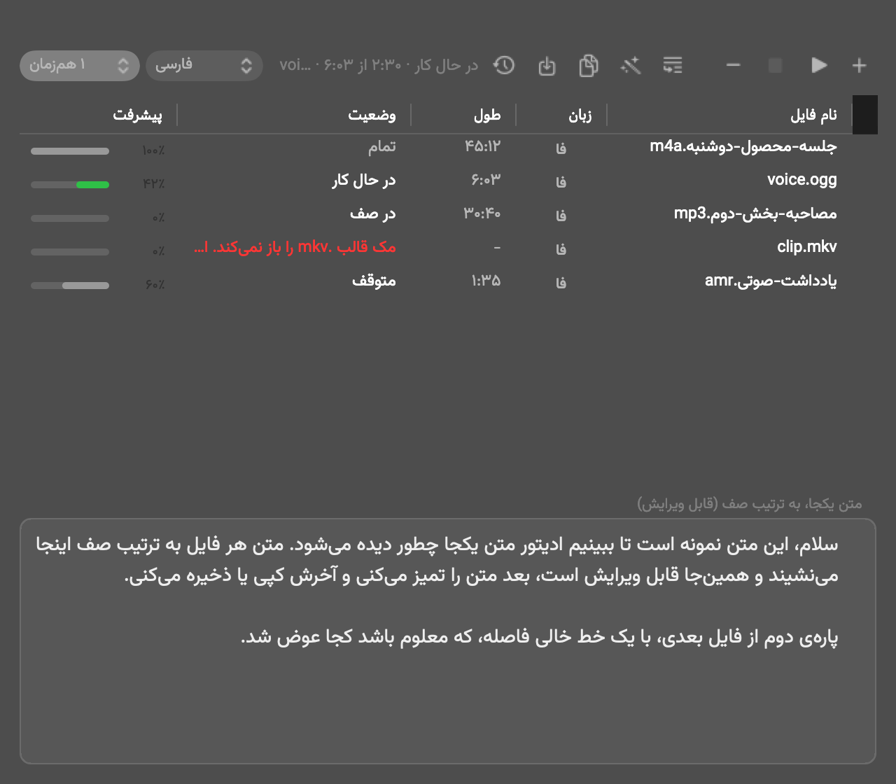

# زمزمه (Zemzeme)

دیکته فارسی روی مک، شناور روی هر اپ، حتی فول‌اسکرین. دابل‌تپ Command راست، حرف بزن،
و **وقتی حرفت تمام شد یک بار Command راست را بزن**: متن یکجا می‌آید.

**رایگان، و بی هیچ حسابی.** نه ثبت‌نام، نه لاگین، نه کلید، نه سقف دقیقه. دیکته و
رونویسی فایل از همان لحظه‌ی نصب کار می‌کنند. یک فیچر اختیاری (تمیز کردن متن با هوش
مصنوعی) کلید می‌خواهد و پیش‌فرض خاموش است. در عوض صدا به سرور گوگل می‌رود:
[داده و حریم خصوصی](#داده-و-حریم-خصوصی) را قبل از استفاده بخوان.

*[English summary](README.en.md)*



- [نصب](#نصب)
- [اجازه‌هایی که مک می‌پرسد](#اجازه‌هایی-که-مک-می‌پرسد)
- [اولین دقیقه](#اولین-دقیقه)
- [میان‌برها](#میان‌برها)
- [امضای ته متن](#امضای-ته-متن)
- [کلید رایگان جمینای (اختیاری)](#کلید-رایگان-جمینای-اختیاری)
- [داده و حریم خصوصی](#داده-و-حریم-خصوصی)
- [چرا دوباره نوشته شد](#چرا-دوباره-نوشته-شد)
- [اجزا](#اجزا)
- [چرا تک‌تپ یعنی پایان](#چرا-تک‌تپ-یعنی-پایان)
- [اندازه‌گیری](#اندازه‌گیری)
- [بیلد و ابزارها](#بیلد-و-ابزارها)

**این پروژه با vibe coding ساخته شده**: با گفت‌وگوی مستقیم با یک ایجنت هوش‌مصنوعی
(Claude Code)، نه خط‌به‌خط دستی. کامنت‌ها و همین README هم همان‌طور نوشته شده‌اند و
«چرا» را نگه می‌دارند، نه فقط «چی». یعنی جایی ممکن است باگی باشد که هنوز کسی ندیده.
دیدیش؟ Issue بزن یا مستقیم PR بده؛ استقبال می‌شود.

نسخه دو. نسخه یک متن را در حین حرف زدن نشان می‌داد و همان یک تصمیم کل پیچیدگی‌اش را
ساخت؛ چرایی‌اش در [چرا دوباره نوشته شد](#چرا-دوباره-نوشته-شد). تاریخچه‌ی نسخه یک روی
تگ `v1-parked` همین ریپو مانده است.

## نصب

**نیازها:** مک با macOS 13 یا بالاتر (اینتل یا اپل سیلیکون)، و Xcode Command Line
Tools. اگر نداری، یک بار این را بزن و پنجره‌ی اپل را قبول کن:

```bash
xcode-select --install
```

**راه پیشنهادی، یک خط:** سورس را می‌گیرد، کامپایل می‌کند، در `/Applications`
می‌گذارد و اجرا می‌کند.

```bash
curl -fsSL https://raw.githubusercontent.com/smk-labs/zemzeme/main/install.sh | bash
```

چند ثانیه طول می‌کشد: کل بیلد یک فراخوان `clang` است و هیچ وابستگی‌ای ندارد، نه در
بیلد نه در اجرا.

**چرا از سورس و نه یک فایل آماده؟** اپ با گواهی خودساخته امضا می‌شود، نه با گواهی
اپل. هر `.app` که دانلود شود برچسب قرنطینه می‌خورد و مک می‌گوید «damaged». بیلد روی
خودِ دستگاه این مسئله را از ریشه ندارد، و یک سود دیگر هم دارد: گواهی مالِ همین مک
می‌شود، پس **اجازه‌های اکسسبیلیتی و میکروفن از بیلدهای بعدی هم جان سالم می‌برند** و
دوباره پرسیده نمی‌شوند.

**اگر فایل می‌خواهی:** `Zemzeme-2.4.0.dmg` در
[Releases](https://github.com/smk-labs/zemzeme/releases) هست. اپ را به Applications
بکش، بعد یک بار برچسب قرنطینه را بردار، وگرنه باز نمی‌شود:

```bash
xattr -dr com.apple.quarantine /Applications/Zemzeme.app
```

**به‌روزرسانی و حذف:** به‌روزرسانی همان دستور نصب است. حذف: اپ را به سطل آشغال
ببر و اگر خواستی داده‌اش را هم پاک کن، `~/Library/Application Support/Zemzeme`.

## اجازه‌هایی که مک می‌پرسد

دو تا، و هر دو لازم‌اند. اپ سر اولین اجرا خودش توضیح می‌دهد و پنجره‌ها را باز می‌کند.

| اجازه | کِی پرسیده می‌شود | بی آن چه می‌شود |
|---|---|---|
| **Accessibility** | سر اولین اجرا | متن سر کرسر نوشته نمی‌شود، و دابل‌تپ Command راست هم شنیده نمی‌شود |
| **میکروفن** | سر اولین دیکته | هیچ صدایی گرفته نمی‌شود |

Accessibility را مک در «System Settings › Privacy & Security › Accessibility»
می‌خواهد. اگر جا انداختی، از منوی زمزمه «اجازه‌های مک» همان صفحه را باز می‌کند. اپ
مرتب نگاه می‌کند: لحظه‌ای که تیک را بزنی هاتکی خودش بالا می‌آید و ری‌استارت لازم
نیست.

سر اولین اجرا یک تیک هم می‌بینی: **«بعد از روشن شدن مک، زمزمه خودش بالا بیاید»**،
که پیش‌فرض روشن است. عمدی است: اپِ بسته هیچ کلیدی را نمی‌شنود، پس زمزمه‌ای که بعد از
ری‌استارت بالا نیاید عملا هاتکی ندارد. هر وقت خواستی، «پیشرفته › اجرای خودکار».

## اولین دقیقه

۱. **Command راست را دو بار پشت هم بزن** (همان کنار فلش‌ها؛ Command چپ کاری نمی‌کند).
۲. **حرف بزن.** تا وقتی حرف می‌زنی هیچ متنی نشان داده نمی‌شود، و این عمدی است.
   نقطه‌ی سبز روی پنل یعنی می‌شنوم.
۳. **حرفت که تمام شد یک بار Command راست را بزن.** متن یکجا در پنل می‌نشیند. **یک بار
   روی متن کلیک کن** تا فوکوس بگیرد و بتوانی ویرایشش کنی.
۴. **Esc** همان متن را سر کرسر درج می‌کند و سشن را می‌بندد.

تا وقتی می‌شنود، پنل همین یک نوار باریک است و هیچ متنی نشان نمی‌دهد. نقطه‌ی سبز یعنی
صدا می‌رسد:



نوار پایین پنل پر از آیکون است و **زیر هر کدام یک حرف ریز نوشته شده**. همان حرف با
Command راست همان کار را می‌کند. کارت راهنما فهرست کاملشان است:

```
Command راست + H
```

سه چیزی که تازه‌کارها بیشتر از همه می‌پرسند:

- **چرا وسط حرف زدن متنی نمی‌بینم؟** چون کیفیت این‌طور بهتر است؛ دلیلش
  [پایین‌تر](#چرا-دوباره-نوشته-شد) با عدد آمده. اگر متنِ لحظه‌ای می‌خواهی،
  `Command راست + P` پیش‌نمایش خام را روشن می‌کند (پیشنهاد ما خاموش ماندنش است).
- **متن کجا می‌رود؟** دو حالت دارد و `Command راست + E` بینشان می‌چرخد: «جمع در
  پنل» (پیش‌فرض) و «کنار کرسر». در دومی پنلی نیست، فقط یک نقطه، و متن سر پایان یک
  بار سر کرسر درج می‌شود.
- **زبان؟** `Command راست + L` بین فارسی و انگلیسی می‌چرخد، **و همان لحظه اثر
  می‌کند**، حتی وسط حرف زدن و هر چند بار که خواستی. آنچه تا آن لحظه گفته‌ای با زبان
  قبلی رونویسی می‌شود و بعدش با زبان تازه؛ متن هر دو به ترتیب به هم می‌چسبد.
- **اپ وسطش بسته شد؟** حرفِ نرسیده باز هم گم نمی‌شود. هر تکه‌ی در انتظار یک سطر در
  یک دفترچه‌ی کوچک کنار سشن است (`queue.json`) و صدایش همان `audio.flac` کنارش، پس
  لانچِ بعدی خودش برش می‌دارد و تمامش می‌کند: بی‌رابط، بی‌صدا، و متن در `text.txt` و
  در همان ردیف تاریخچه‌ی خودِ آن سشن می‌نشیند.
- **اینترنت وسط کار رفت؟** چیزی نمی‌بینی، و این عمدی است. حرف زدنت ادامه دارد، صدا
  ضبط می‌شود، تکه‌ها بریده و صف می‌شوند، و تکه‌ی نرسیده خودش دوباره می‌رود: ۱، ۲، ۴، ۸،
  ۱۵، ۳۰ ثانیه، و با اولین تکه‌ای که برسد از نو. `Esc` هم گروگان نمی‌ماند: هرچه رسیده
  همان لحظه تحویل می‌شود و بقیه بعدا سر جای خودشان می‌نشینند. پنل فقط یک شمار آرام
  نشان می‌دهد («یک تکه هنوز در راه است»)، نه پیام خطا و نه کاری که باید بکنی.

## میان‌برها

همه روی **Command راست**‌اند. کارت `Command راست + H` همین جدول را با کی‌کپ نشان
می‌دهد و وضعیت همان لحظه را هم می‌گوید.

| کلید | کار |
|---|---|
| دو بار ⌘ | شروع و پایان دیکته |
| یک بار ⌘ | حرفت که تمام شد: متن می‌آید |
| Esc | پایان دیکته و درج متن |
| ⌘ + Space | مکث و ادامه |
| ⌘ + C | کپی متن تا اینجا |
| ⌘ + I | درج متن سر کرسر |
| ⌘ + D | دور ریختن هرچه تا اینجا گفته‌ای: متن، صدا، شمارنده. از صفر |
| ⌘ + L | عوض کردن زبان، همان لحظه |
| ⌘ + E | جابه‌جایی بین «جمع در پنل» و «کنار کرسر» |
| ⌘ + S | حساسیت بالای میکروفن، برای پچ‌پچ و اتاق ساکت |
| ⌘ + F | پنل رونویسی فایل صوتی |
| ⌘ + T | تاریخچه: بیست متن آخر، با درج و کپی |
| ⌘ + H | کارت راهنما |
| ⌘ + B | شنیدن دوزبانه |
| ⌘ + P | پیش‌نمایش خام |
| ⌘ + A | تمیز کردن متن با هوش مصنوعی |
| ⌘ + G | امضا: یک خط کوتاه ته هر متن |

جز `F` و `T` و `H` و `B` و `P` و `A` و `G`، بقیه‌ی حرف‌ها فقط وسط دیکته کار می‌کنند. پنل را هم
می‌شود از هر جای خالی‌اش کشید و جابه‌جا کرد.

کارت راهنما (`Command راست + H`) همین‌ها را با کی‌کپ نشان می‌دهد و وضعیت همان لحظه را
هم می‌گوید، پس لازم نیست این جدول را به یاد بسپاری:



**اگر با دابل‌تپ، دیکته‌ی خودِ مک هم باز می‌شود:** مک هم میان‌بر دیکته دارد و روی
بعضی دستگاه‌ها روی «دو بار Command» نشسته. آن‌وقت یک دابل‌تپ **دو** دیکته را باز
می‌کند و صدای یک میکروفن بین دو شنونده تقسیم می‌شود، یعنی هر دو ناقص می‌شنوند.
خاموش کردنش یک بار است: تنظیمات سیستم › Keyboard › Dictation، و میان‌بر را روی
`Off` بگذار.

زمزمه خودش این را پیدا می‌کند: اگر برخورد باشد، یک خط هشدار در منو می‌آید که همان
پنجره را باز می‌کند، و در `app.log` هم می‌نشیند. خودِ تیک را عمدا نمی‌زنیم، چون
تنظیمِ سیستم مالِ کاربر است. از تپ هم نمی‌شود بلعیدش: رویدادِ خامِ Command را که
مصرف کنیم، هر `Cmd+C` و `Cmd+V` هم با آن می‌رود.

**بی کیبورد:** آدرس `zemzeme://toggle` همان دابل‌تپ را انجام می‌دهد، برای Karabiner
و اپ Shortcuts. رول آماده‌ی Karabiner در [karabiner-zemzeme.json](extras/setup/karabiner-zemzeme.json)
است و لازم نیست: هاتکی داخلی خودِ اپ کافی است. رول فقط وقتی کاری می‌کند که زمزمه
**بسته** باشد، و آن‌وقت بالا می‌آوردش.

## امضای ته متن

یک خط کوتاه که با یک خط فاصله ته هر متنی می‌رود که از زمزمه بیرون می‌آید: کپی، درج،
تحویل سر Esc، تاریخچه، و کپیِ رونویسی فایل. تاگلش `Command راست + G` است و پیش‌فرض
خاموش.

خطِ پیش‌فرض این است:

```
(speech-to-text, mentally fix typos)
```

چون بیشترین کاربردش دیکته کردنِ پرامپت برای هوش مصنوعی است: خواننده بداند واژه‌ی
عجیب و نویسه‌ی جابه‌جا کارِ گفتاربه‌متن است، نه چیزی که گوینده گفته.

**ولی خط مالِ خودت است.** از منوبار، ردیف «خطِ امضا…»، هر چیزی می‌شود گذاشت: نامت،
یک ارجاع، یا یک سلبِ مسئولیت. همان‌جا دکمه‌ی «برگرداندن پیش‌فرض» هم هست. خط را خالی
بگذاری، تاگل روشن هم که باشد چیزی چسبانده نمی‌شود.

امضا **هیچ‌جا ذخیره نمی‌شود**: نه در ادیتور پنل، نه در تاریخچه، نه در فایلِ متنِ سشن.
فقط لحظه‌ی بیرون رفتن سوار می‌شود. یعنی خاموش کردنِ تاگل، متنِ ردیف‌های قدیمیِ
تاریخچه را هم از همان لحظه بی‌امضا می‌کند، و ویرایشِ متن در پنل هیچ‌وقت با خطِ امضا
درگیر نمی‌شود.

## کلید رایگان جمینای (اختیاری)

زمزمه بی هیچ کلیدی کار می‌کند و دیکته و رونویسی فایل از لحظه‌ی نصب راه‌اند. کلید فقط
برای یک چیز است: **پاس هوش مصنوعی**، همان `Command راست + A`، که متنِ رونویسی‌شده را
مرتب می‌کند (نقطه و ویرگول، پاراگراف، درست کردن غلط‌های آشکار). پیش‌فرض خاموش است.

کلید رایگان است و کارت بانکی نمی‌خواهد. پنج قدم:

۱. برو به [aistudio.google.com/apikey](https://aistudio.google.com/apikey).
۲. با حساب گوگل خودت وارد شو.
۳. دکمه‌ی **Create API key** را بزن.
۴. کلید ساخته‌شده را کپی کن. با `AIza` شروع می‌شود.
۵. در مک، از منوی زمزمه **«کلید Gemini (اختیاری)…»** را بزن، کلید را پیست کن و ذخیره.

همین. ترمینال لازم نیست و کلید می‌رود در Keychain خودت (سرویس `zemzeme-gemini`)، نه در
ریپو، نه در فایل، نه در لاگ.

> **اگر بعد از یک بیلد تازه، مک وسط کار رمز کی‌چین خواست:** کی‌چین هر آیتم را به
> «اثر انگشتِ» باینریِ سازنده می‌بندد، و آن اثر انگشت با هر بیلد عوض می‌شود. یعنی
> بیلد تازه از نظر کی‌چین یک اپِ دیگر است و اجازه‌ی قبلی به آن نمی‌رسد. `build.sh`
> خودش این را می‌بیند و همان‌جا در ترمینال یک بار رمز می‌پرسد تا اجازه تازه شود؛
> دستی هم می‌شود:
>
> ```bash
> security set-generic-password-partition-list -s zemzeme-gemini -a "$(id -un)" -S "apple:,apple-tool:,cdhash:$(codesign -d --verbose=4 /Applications/Zemzeme.app 2>&1 | awk -F= '/^CDHash=/{print $2}')"
> ```
>
> راهِ همیشگی‌اش گواهی Developer ID اپل است: آن‌وقت کی‌چین به‌جای اثر انگشتِ باینری،
> شناسه‌ی تیم را می‌نویسد و اجازه از هر بیلدی جان سالم می‌برد.

**کلید سر ذخیره تست می‌شود**، با یک درخواست عمدا کوچک به همان مدلی که خود پاس استفاده
می‌کند. کلیدی که گوگل نشناسد اصلا ذخیره نمی‌شود و همان‌جا می‌گوید چرا. دلیلش این است
که کلیدِ غلطِ ذخیره‌شده یعنی تاگلی که روشن به نظر می‌رسد و هیچ کاری نمی‌کند. هر وقت
هم خواستی خودت بپرس:

```bash
zemzeme --checkkey
```

**اگر صفحه‌ی AI Studio برایت باز نشد** یا اجازه‌ی ساخت کلید نداد، محدودیت منطقه‌ای
گوگل است، نه ایراد زمزمه. دیکته و رونویسی فایل بی کلید هم کامل کار می‌کنند؛ فقط پاس
هوش مصنوعی خاموش می‌ماند.

**قبل از گذاشتن کلید، این را بخوان:** روی سطح رایگانِ جمینای، شرط سرویس خودِ گوگل
می‌گوید ممکن است از آنچه می‌فرستی برای بهتر کردن مدل‌هایش استفاده کند. جزئیات در
[داده و حریم خصوصی](#داده-و-حریم-خصوصی).

## داده و حریم خصوصی

بخوانش قبل از استفاده، به‌خصوص قبل از گذاشتن کلید جمینای.

- **دیکته و رونویسی فایل همیشه به سرور گوگل می‌روند، حتی بی هیچ کلیدی.** موتور یک
  نقطه‌ی عمومی و مستندنشده‌ی گوگل است (`speech-api/full-duplex/v1`)، نه مدلی روی خودِ
  دستگاه: صدایت استریم می‌شود تا متن برگردد. کلیدش عمومی است (کلید Chromium)، نه مال
  تو، ولی صدا همچنان از دستگاهت بیرون می‌رود.
- **رایگان است و سقف هم ندارد، ولی قراردادی هم پشتش نیست.** این نقطه مستند نیست و
  هیچ شرط سرویسی برایش منتشر نشده. یعنی نه تعرفه‌ای هست که نگرانش باشی، و نه تعهدی
  که به آن تکیه کنی: **فرض را بر این بگذار که گوگل می‌تواند از آنچه می‌فرستی برای
  بهتر کردن مدل‌هایش استفاده کند.** حرف محرمانه را با هیچ ابزار ابری دیکته نکن، از
  جمله این یکی.
- **صدا هیچ‌وقت به مدل هوش مصنوعی نمی‌رود، در هیچ حالتی.** نسخه یک در حالت یادداشت کل
  فایل صدا را به جمینای می‌داد و روی کیفیت هم حق داشت. آن معامله دیگر روی میز نیست:
  پاس هوش مصنوعی فقط **متن** می‌گیرد.
- **پاس هوش مصنوعی پیش‌فرض خاموش است** و فقط با کلید خودت کار می‌کند. کلید از
  [Google AI Studio](https://aistudio.google.com/apikey) رایگان است. روی سطح رایگانِ
  جمینای، شرط سرویس گوگل صریحا می‌گوید ممکن است از آنچه می‌فرستی برای بهتر کردن
  مدل‌هایش استفاده کند؛ [شرط سرویس](https://ai.google.dev/gemini-api/terms) را قبل از
  گذاشتن کلید بخوان.
- **کلید موقع ذخیره تست می‌شود**، با یک درخواست عمدا کوچک (چند توکن) به همان مدلی که
  خودِ پاس استفاده می‌کند. کلیدی که گوگل نشناسد اصلا ذخیره نمی‌شود و همان‌جا می‌گوید
  چرا. دلیلش صریح است: کلیدِ غلطِ ذخیره‌شده یعنی تاگلی که آبی است و هیچ کاری نمی‌کند، و
  کاربر هر سشن منتظر چیزی می‌ماند که قرار نیست بیاید. اگر اینترنت نبود کلید ذخیره
  می‌شود و پیام می‌گوید تست نشد؛ خودت هم می‌توانی هر وقت خواستی بپرسی:
  `zemzeme --checkkey`.
- **صدای سشن هفت روز می‌ماند، و این پیش‌فرض روشن است.** ضبط در طول سشن همیشه انجام
  می‌شود (فایل روی دیسک مرجع همه‌چیز است و اگر شبکه بمیرد حرفِ گفته‌شده نباید گم شود)،
  و از ۲۸ اوت ۲۰۲۶ سر پایان هم می‌ماند: هفت روز، بعد خودکار جارو می‌شود. پیش از این
  پیش‌فرض خاموش بود و همان لحظه پاک می‌شد. عوض شد چون صدا تنها توری است که تا امروز
  واقعا یک متنِ گم‌شده را برگردانده. از منو («پیشرفته» ← «نگه داشتن صدا») می‌شود
  خاموشش کرد، و آن‌وقت صدا همان لحظه‌ی پایان می‌رود.
- **متنِ هر دیکته شصت روز می‌ماند، و این یکی پیش‌فرض روشن است.** جای دیگری برای رفتن
  ندارد: `history.jsonl` روی همین دستگاه، کنار بقیه. شصت روز از منو قابل تغییر نیست
  ولی از دیفالتز هست: `defaults write io.seyed.zemzeme historyKeepDays 30`، و `0`
  یعنی هرگز جارو نکن. همان جارو خطوطِ کهنه‌ی `app.log` را هم می‌برد.
- **همه‌چیز محلی و در اختیار خودت است**: `~/Library/Application Support/Zemzeme`.
  سروری از طرف زمزمه اصلا وجود ندارد.
- **کلید جمینای فقط در Keychain خودت است**: نه در ریپو، نه در plist، نه در لاگ.

## چرا دوباره نوشته شد

نقطه‌ی رایگان گوگل بعد از حدود ۲۵ تا ۳۰ ثانیه صدای پیوسته از تشخیص می‌افتد. نسخه یک
برای همین هر ۲۰ تا ۲۴ ثانیه سشن را می‌چرخاند، و برای اینکه کلمه‌ی سر درز گم نشود
هم‌پوشانی و جوش و راچت و بازپخش ساخت.

بعد اندازه گرفتیم. همان صدا، همان خط لوله، تنها متغیر طولِ تکه (برشِ **ثابت**، یعنی
بدترین حالت):

| طول تکه | ضبط ۰۷ (روزمره) | ضبط ۰۲ (اصطلاح‌های سنگین) |
|---|---|---|
| ۲۰ ثانیه | ۳۷٪ | ۳۷٪ |
| ۱۰ ثانیه | ۶۲٪ | ۵۷٪ |
| **۷ ثانیه** | **۷۷٪** | **۷۰٪** |
| ۵ ثانیه | ۷۳٪ | ۶۴٪ |

یعنی کیفیت خیلی زودتر از سقفِ سرور فرو می‌ریزد، و نسخه یک دقیقا در بدترین ناحیه‌ی این
منحنی کار می‌کرد. **تمام آن کارِ درز و دوخت، تعمیر خرابی‌ای بود که خودِ انتخابِ طولِ
تکه می‌ساخت.**

منحنی قله دارد: کوتاه‌تر تا هفت ثانیه کمک می‌کند، از آن کوتاه‌تر بدتر، چون تکه‌ی خیلی
کوتاه زمینه‌ی کافی برای مدل ندارد و مرزهای بیشتر یعنی کلمه‌های نصف‌شده‌ی بیشتر.

پس نسخه دو یک تصمیم دارد و بقیه‌اش نتیجه‌ی همان است: **هر تکه ~۷ ثانیه، بریده سر
سکوت.** هیچ سشنی به سقف سرور نزدیک نمی‌شود، پس چرخشی لازم نیست؛ هیچ تکه‌ای با تکه‌ی
دیگر هم‌پوشانی ندارد، پس درزی نیست که دوخته شود.

## اجزا

- `/Applications/Zemzeme.app` (سورس در `app/Sources-objc/`): اپ منوبار بدون هیچ
  وابستگی. پنل `NSPanel` بدون گرفتن فوکس، روی همه Space ها، نیمه‌شفاف، و با کشیدن از
  هر جایی که دکمه نیست جابه‌جا می‌شود.
- **برش‌زن** (`seg.m`): تنها بخشی که باید درست باشد. در پنجره‌ی ۴ تا ۱۲ ثانیه هر
  دوره‌ی سکوتِ دست‌کم ۲۰۰ میلی‌ثانیه‌ای را پیدا می‌کند، هر کدام را با **طول** و **عمقِ**
  مکث امتیاز می‌دهد، و بالاترین امتیاز را می‌بُرد، نه نزدیک‌ترین به هدف. امتیاز در
  وزنِ طول ضرب می‌شود و آن وزن خودِ منحنیِ جدول بالاست، پس معیار «چقدر به عدد دلخواه
  نزدیکی» نیست، «چقدر متن سالم درمی‌آید» است. وسط مکث بریده می‌شود نه لبه‌اش، پس هیچ
  کلمه‌ای دو نیم نمی‌شود.
- **برشِ تحمیلی**: اگر در کل پنجره هیچ مکثی نبود (گفتار پیوسته‌ی دوازده ثانیه‌ای)،
  آرام‌ترین فریمِ ثانیه‌ی آخر بریده می‌شود و **صریحا در لاگ گزارش می‌شود** با همان عددِ
  بلندی‌ای که به آن رضایت داده‌ایم. هیچ‌وقت بی‌صدا سر تایمر بریده نمی‌شود.
- **خط لوله** (`pipe.m`): هر تکه یک سشن تازه‌ی خودش را می‌گیرد و می‌میرد. سرهم کردن
  متن کلِ الگوریتم است: **تکه‌ها با یک فاصله به هم می‌چسبند.** نه هم‌پوشانی، نه جوش،
  نه جست‌وجوی درز، نه راچت. تکه‌ی بی‌صدا اصلا فرستاده نمی‌شود، و تکه‌ای که حرف داشت و
  سشنش لال برگشت یک بار دیگر امتحان می‌شود.
- **صف** (`queue.m`): واحدِ حقیقت **تکه** است، نه رشته‌ی سرهم‌شده. هر تکه یک جا با
  حالتِ خودش دارد (رسید، حرفی نبود، هنوز در راه) و متن هر لحظه از روی همان جاها
  ساخته می‌شود، پس ترتیب ساختاری است: تکه‌ای که دیر برسد خودش سر جای خودش می‌نشیند و
  هیچ جراحیِ رشته‌ای لازم نیست.
- **خالی همیشه شکست نیست**، و این تصحیحِ ریشه‌ای همه‌ی این بخش است. `ZSegHasVoice`
  انرژی می‌سنجد نه حرف، و آستانه‌اش عمدا کوچک است تا پچ‌پچ از آن رد شود؛ پس یک نفس یا
  دستی روی میز هم از آن رد می‌شود و به شبکه می‌رسد. گوگل درست جواب می‌دهد «حرفی نبود»
  و خط را **تمیز** می‌بندد. جداکننده همان است: بسته شدنِ تمیز با متنِ خالی یعنی تکه
  تمام است و سهمش هیچ؛ هر دلیل دیگری یعنی جواب نگرفتیم و باید دوباره رفت. (پیش از
  این، هر دو یک شکل داشتند و ۲۰۲۶-۰۸-۱۹ یک نفسِ ۱٫۴ ثانیه‌ای ۱۷۴۱ نویسه را گروگان
  گرفت: چهار بار `Esc`، و آخرش چهار دقیقه دیکته دور ریخته شد.)
- **یک کارگر، یک ساعت**: در کل سشن همیشه **یک** درخواست در پرواز است، حتی با پاس دومِ
  انگلیسی یا وقتی وسط سشن زبان عوض شده. و عقب‌نشینی یکی است برای کلِ صف، نه یکی برای
  هر تکه: خرابی مالِ شبکه است، پس ده تکه‌ی در انتظار یعنی ده برابر تلاشِ بی‌فایده روی
  همان خطِ قطع. خودِ تلاشِ دوباره تنها سنجشِ اینترنت است که وجود دارد.
- **گروگان‌گیری ممنوع**: سر پایان فقط تا **دورِ اول** صبر می‌شود (هر تکه یک بار
  امتحان شود)، نه تا خالی شدنِ صف. آنچه رسیده همان لحظه تحویل می‌شود. سر کرسر اما
  فقط تا **اولین جای نرسیده** می‌رود: اگر تکه‌ی هفتم در راه باشد و هشتم را حالا درج
  کنیم، هفتم که برسد جایی برای نشستن ندارد.
- **و روی دیسک** (`queue.json`): تکه‌ی در انتظار **هیچ نسخه‌ی صوتیِ خودش ندارد**. یک
  افستِ فریم و یک تعداد فریم است، و صدا همان `audio.flac` کنارِ سشن. دفترچه سر هر
  تغییرِ حال نوشته می‌شود و همان لحظه که چیزی در انتظار نماند پاک می‌شود، چون
  دفترچه‌ی مانده یعنی لانچِ بعدی سشنِ تمام‌شده را دوباره برمی‌دارد. `audio.flac` هم تا
  تکه‌ای در راه است پاک نمی‌شود، حتی اگر تاگل «ضبط صدای سشن» خاموش باشد.
- **و سر لانچ**: هر سشنی که دفترچه دارد برداشته و تمام می‌شود، بی رابط و بی کلید.
  پنجره‌ی تازه‌ای برای حرفِ ده دقیقه پیش مزاحمت است نه خدمت؛ متن سر جای خودش
  می‌نشیند و چون تاریخچه سر خواندن با sid جمع می‌کند، همان ردیفِ خودِ آن سشن کامل
  می‌شود. پاس تمیزکاری آنجا اجرا نمی‌شود: خواندن کلید می‌تواند پنجره‌ی رمز بالا
  بیاورد، آن هم بی‌آنکه کسی منتظر باشد.
- **موتور** (`engine.m`): میکروفن، ضبط روی دیسک، و خط لوله. و بس. در حین حرف زدن هیچ
  متنی از خط لوله نمی‌دهد، فقط بلندی صدا برای نشان. (پیش‌نمایش که روشن باشد، متنِ
  خاکستری از یک استریم جدا و نمایشی می‌آید، نه از این مسیر.)
- **عوض کردن زبان وسط سشن**: همان یک تصمیمِ «تکه‌ها مستقل‌اند» این را تقریبا مجانی
  می‌کند. `Command راست + L` خط لوله‌ی جاری را همان‌جا می‌بندد و بعدی را با زبان تازه
  باز می‌کند؛ خط لوله‌ی بسته زنده می‌ماند تا متنش برسد و سر پایان به ترتیب سر جایش
  می‌نشیند. صدایی که تا آن لحظه در بافر بوده با زبان **قبلی** رونویسی می‌شود، که
  درست است: به همان زبان گفته شده. در نسخه یک، با آن همه درز و جوش، همین کار شدنی
  نبود.
- **یک مسیر برای هر دو کار**: دیکته‌ی زنده و رونویسی فایل از یک برش‌زن و یک
  رونویسِ‌تکه می‌خوانند. تفاوتشان فقط زمان‌بندی است: زنده یک سشن در هر لحظه (کاربر
  منتظر است و نقطه‌ی رایگان نباید اذیت شود)، فایل چند تا با هم.
- ورودی صدا: `l16` خام ۱۶ کیلوهرتز، آپلود با FLAC (نصف حجم). اندازه‌گیری‌شده: همان
  فایل با FLAC و با پی‌سی‌ام خام **دقیقا** یک متن داد، پس کدک بی‌گناه است.
- **دو حالت**: «جمع در پنل» (متن در ادیتور خود پنل می‌نشیند و با یک کلیک روی متن قابل
  ویرایش است؛ پنل با **آمدنش** فوکوس نمی‌گیرد، فقط با همان کلیک) و
  «کنار کرسر» (بی‌پنل، فقط یک نقطه؛ متن سر پایان یک بار سر کرسر درج می‌شود).
  `Command راست + E` بینشان می‌چرخد.
- **دو روش نوشتن** («پیشرفته › روش نوشتن»): «درج مستقیم» متن را حرف‌به‌حرف می‌نویسد و
  به کلیپ‌بورد دست نمی‌زند؛ «ذخیره در کلیپ‌بورد» متن را در کلیپ‌بورد می‌گذارد و
  Command+V را می‌زند، که برای متن بلند آنی است ولی کلیپ‌بورد قبلی‌ات را عوض می‌کند.
  در Windows App همیشه راه کلیپ‌بورد گرفته می‌شود و این انتخاب رویش اثری ندارد: درج
  مستقیم آنجا فقط یک مشت `a` می‌نویسد.
  یک استثنای دیگر هم هست و مالِ **نباختنِ متن**: متنِ بلند اول با یک نوشتنِ
  اکسسبیلیتی می‌رود که تجزیه‌ناپذیر است، و اپی که آن را نپذیرد (خیلی از اپ‌های
  کرومیوم‌بنیان) همان اپی است که رگبار رویداد را هم کامل نمی‌گیرد. آنجا از کلیپ‌بورد
  می‌رود، چون تنها راهِ اتمیکِ باقی‌مانده است. کلیپ‌بورد چیزی نمی‌بازد: متن سر هر
  تحویل از قبل رویش کپی شده.
- **سقف پنج دقیقه**: این ابزار دیکته است نه ضبط جلسه. سر پنج دقیقه سشن خودش تمام
  می‌شود، هرچه رونویسی شده می‌ماند، و پنل صریح می‌گوید صدای بلندتر جای خودش را دارد:
  پنل رونویسی فایل با `Command راست + F`. همان‌جاست که جلسه و مصاحبه و پادکست پیاده
  می‌شوند، چند فایل پشت هم، با متنی که همان‌جا قابل ویرایش است:

  
- **پاس دوم انگلیسی** (اختیاری، پیش‌فرض خاموش): همان صدا، هم‌زمان با `en-US`. روی متنِ
  پر از اصطلاح فنی خیلی خوب است و روی گفتار روزمره تقریبا هیچ، پس بیمه است نه ستون.
  دکمه‌ی B روی نوار (دومین تاگل، بین حساسیت و پیش‌نمایش) یا `Command راست + B`
  روشن و خاموشش می‌کند، از دور بعدیِ شنیدن. روشن که باشد، دکمه رنگی می‌شود.
- **پیش‌نمایش** (آزمایشی، اختیاری، پیش‌فرض خاموش، فقط حالت جمع در پنل): متن **خاکستری**
  هم‌گام با حرف زدنت جلو می‌رود، کلمه‌به‌کلمه. سر پایان همه‌اش با متنِ واقعی جایگزین و
  **سفید** می‌شود. رنگ یک معنی دارد: خاکستری یعنی هنوز تمام نشده، پس با پاس هوش
  مصنوعیِ روشن تا نشستنِ آن پاس خاکستری می‌ماند. دکمه‌ی P روی نوار یا `Command راست + P`.

  **خام است و باید هم باشد.** یک سشن جدا و پیوسته است که هر ~۸ ثانیه می‌چرخد، یعنی
  همان ناحیه‌ای که کیفیت در آن پایین‌تر است. اندازه‌گیری روی ضبط ۰۷ با `--preview`:
  پیش‌نمایش ۴۳۹ نویسه داد، متن نهایی ۶۰۲. کلمه می‌اندازد و وسط راه نظرش عوض می‌شود.
  معامله آگاهانه است: **سریع و خام، بعد درست و سفید.**

  **و به متن نهایی دست نمی‌زند.** یک قاعده در کد نوشته شده و همه‌چیز از آن می‌آید:
  خروجی این استریم فقط به دُم خاکستری پنل می‌رود؛ نه وارد متن سشن می‌شود، نه درج، نه
  کپی، نه روی دیسک. سنجیده شد، نه فرض: همان ضبط ۰۷ با پیش‌نمایشِ روشن و در زمان
  واقعی، ۱۲۹ واژه، ۳۳ گم‌شده، ۷۵٪، صفر برش تحمیلی، ۲٫۱ ثانیه تا متن، یعنی مو به مو
  همان عددِ جدولِ پایین.

  چرا سشن جدا و نه خودِ خط لوله: برش‌زن تا بافر به دوازده ثانیه نرسد تصمیم نمی‌گیرد و
  مرزی که انتخاب می‌کند ~۵ ثانیه عقب‌تر از «الان» است. سشنی که زنده تغذیه شود، تا وقتی
  مرز معلوم شود صدای تکه‌ی بعدی را هم بلعیده: هم‌پوشانی، یعنی همان درزی که نسخه دو برای
  نداشتنش نوشته شد. آن دوازده ثانیه اندازه‌گیری‌شده است و برای متنِ سریع دست نمی‌خورد.

  دو تدبیر که هزینه‌اش را مهار می‌کنند: سقفِ صدای معطلِ استریم نمایشی سه ثانیه است (در
  برابر شصت ثانیه‌ی مسیر کیفیت)، پس روی شبکه‌ی ضعیف **اول خودش** عقب می‌کشد و سر پهنای
  باند دعوا نمی‌کند؛ و سه بار بسته شدنِ پشت سر هم یعنی تا پایان سشن خاموش، نه تلاش
  بی‌پایان روی همان کلید مشترک.

  **و پیشنهاد ما خاموش ماندنش است.** خواندنِ حرفِ خودت وسط حرف زدن رشته‌ی کلام را پاره
  می‌کند، و این نسخه چون سریع است بیشتر هم چشم می‌گیرد.

- **دو نشانِ انتظار، و عمدا شبیه کارِ خودشان**: بعد از اینکه حرفت تمام شد دو انتظار
  ممکن است پیش بیاید و کاربر باید بی‌خواندنِ خط وضعیت بفهمد منتظر کدام است، چون
  طولشان فرق دارد. **میله‌های نارنجیِ صدا** یعنی صدا دارد متن می‌شود (چند ثانیه، و
  هیچ راهی برای خاموش کردنش نیست چون خودِ دیکته است). **جرقه‌های آبی** یعنی پاس هوش
  مصنوعی روی متن (تا ~۲۰ ثانیه، و اختیاری است). رنگ‌ها هم تصادفی نیستند: نارنجی همان
  رنگِ «در حال کار» است و آبی همان رنگی که دکمه‌ی A روشن که باشد می‌گیرد.
- **تاریخچه‌ی متن‌ها** (`Command راست + T`، همیشه روشن): هر متنی که تحویل گرفته‌ای،
  **همان لحظه‌ی تحویل** در `history.jsonl` می‌نشیند. دلیلش صریح است: کلیپ‌بورد و درج
  هر دو بیرون از دست ما هستند (مدیر کلیپ‌بورد ممکن است نگیرد، درج ممکن است جای عوضی
  بنشیند) و `sessions/<تاریخ>/text.txt` هفت‌روزه جارو می‌شود. این یکی شصت روز می‌ماند
  و برای ماندنش لازم نیست هیچ‌کدام از آن دو درست کار کرده باشند.

  فرمتش عمدا JSONL است ــ **یک رکورد، یک خط**: متنِ دیکته خودش خط جدید دارد، پس هیچ
  جداکننده‌ی ساده‌ای امن نیست، ولی JSON خط جدید را `\n` می‌نویسد. یعنی `tail -n 3
  history.jsonl` بی هیچ ابزاری کار می‌کند، و کرشِ وسطِ نوشتن حداکثر همان رکوردِ
  نیمه‌نوشته را می‌برد: خواننده هرچه بعد از آخرین `\n` مانده را دور می‌اندازد و نوشتنِ
  بعدی همان دُم را می‌بندد تا رکوردِ تازه به آن نچسبد. پنجره‌اش بیست تای آخر را نشان
  می‌دهد، هر ردیف با یک دکمه‌ی درج و یک دکمه‌ی کپی، و عمدا nonactivating است تا کرسرت
  از جایی که بود کنده نشود و «درج» همان‌جا بنشیند.

  و هر ردیف **دو** متن دارد، نه یکی: «متن تحویل‌شده» همان که بیرون رفت، و «متن خام»
  هرچه شنیده شد، پیش از ویرایشِ خودت و پیش از پاس هوش مصنوعی. زیرِ جعبه‌ی متن یک کلید
  دو حالته است که بینشان می‌چرخد، و دکمه‌ی کپیِ کنارش همان چیزی را برمی‌دارد که جلوی
  چشم است. دلیلش صریح است: تا پیش از این فقط متنِ تحویل‌شده ذخیره می‌شد، پس هر خرابیِ
  مسیرِ تحویل عینا در تاریخچه هم می‌نشست و آخرین تور با همان خرابی می‌افتاد. ردیف‌هایی
  که پیش از ۲۸ اوت ۲۰۲۶ نوشته شده‌اند خام ندارند و کلیدشان خاموش است، نه اینکه متنِ
  تحویل‌شده را به اسمِ خام نشان بدهند.
- **نگه داشتن صدا** (پیش‌فرض روشن): ضبط همیشه انجام می‌شود، ولی ماندنش انتخاب توست.
  جایش «پیشرفته» در منوبار است و میان‌بر ندارد: یک ترجیحِ یک‌باره است، نه چیزی که وسط
  دیکته لازم شود. روشن یعنی هفت روز روی دیسک، بعد جاروی خودکار؛ خاموش یعنی همان
  لحظه‌ی پایان پاک شود.
- **پاس هوش مصنوعی** (اختیاری، پیش‌فرض خاموش، **فقط روی متن**): فرمتینگ، و اصلاح
  واژه‌ای که صد در صد غلط است. با دو پاس، اسکلت جمله از فارسی و اصطلاح‌ها از انگلیسی.
  اندازه‌گیری روی ضبط ۰۲: «او آف» شد OAuth، «ان پلاسمان» شد N+1، «ایگر لودینگ» شد
  Eager Loading، با ۲۴۰ توکن ورودی و ۲۲۲ توکن خروجی. تنها تورِ ایمنی‌اش یک شرط است:
  خروجیِ کوتاه‌تر از ۷۰٪ ورودی رد می‌شود و متن خام سر جایش می‌ماند.

## چرا تک‌تپ یعنی پایان

در نسخه یک متن حین حرف زدن می‌آمد، پس کاربر هیچ‌وقت لازم نبود چیزی را علامت بدهد.
حالا لازم است، و اپی که ساکت منتظر بماند در حالی که کاربر هم منتظر است، خراب است.

پس این جمله از یک رشته می‌آید (`ZStopHint`) و سه جا نوشته می‌شود: روی خط وضعیت پنل تا
وقتی می‌شنویم، در کارت راهنما، و در حالت کنار کرسر. تک‌تپ Command راست حالا یعنی
پایان؛ مکث سر جایش مانده ولی رفته روی `Command راست + Space`.

## اندازه‌گیری

`tools/fixtures/read-aloud/` هفت متن فارسی و هشت ضبط از خواندنشان دارد، و
[RESULTS.md](tools/fixtures/read-aloud/RESULTS.md) عددها. ابزارها، همه بی‌میکروفن
و بی‌آدم:

```bash
bash tools/seg_test.sh
```

تست طلاییِ برش‌زن: روی هر نه ضبط می‌دواندش و سه ادعا را می‌سنجد. هر مرزی که انتخاب
می‌شود واقعا داخل یک دوره‌ی ساکت است، مسیر تحمیلی فقط وقتی گرفته می‌شود که پنجره
واقعا مکثی نداشته باشد، و جمعِ تکه‌ها دقیقا کل فایل است.

```bash
bash tools/mainq_test.sh
```

یک قاعده را می‌سنجد، چون همان قاعده یک بار اپ را کامل قفل کرد: بلاکی که روی صف اصلی
در حال اجراست حق ندارد منتظر بلاکِ بعدیِ همان صف بماند. صف اصلی سریال است و بازگشتی
نیست، پس چرخاندنِ دستیِ ران‌لوپ بازش نمی‌کند و انتظار ابدی می‌شود. تست هر دو طرف را
نشان می‌دهد: الگوی قدیمی قفل می‌کند، و شکل درست (برگشتن، و جواب در نوبت تازه) نه.

```bash
bash tools/livestring_test.sh
```

باز یک قاعده، باز چون متنِ کاربر را برد: هیچ‌کس حق ندارد `NSTextView.string` را نگه
دارد و بعدا بخواند. آن رشته عکسِ لحظه‌ای نیست، خودِ رشته‌ی زنده‌ی پشت ادیتور است، پس
هر خواننده‌ی معوقی محتوای لحظه‌ی خواندن را می‌گیرد نه لحظه‌ی گرفتن. کپیِ پایانیِ
کلیپ‌بورد یک ثانیه بعد از Esc می‌نشیند و تا آن لحظه ادیتور خالی شده بود: کلیپ‌بورد
به‌جای متن، خالی پر می‌شد و در لاگ `کلیپ‌بورد پایانی، 0 نویسه` می‌نشست. تست با یک
NSTextView واقعی هر دو طرف را نشان می‌دهد، و یک ادعای آخرش خودِ خطِ `editorText` را
می‌سنجد که فردا کسی `copy` را برندارد.

و شش ادعای دیگر، برای همسایه‌ی همین باگ: **تایپِ کاربر نباید گم شود.** مسیر تحویل در
حالت جمع اول متنِ خام را روی ادیتور می‌نوشت و بعد همان را پس می‌خواند، پس هر ویرایشی
بی‌صدا پاک می‌شد؛ کامنتِ بالای همان شرط از روز اول خلافش را ادعا می‌کرد و از روز اول هم
غلط بود، ولی تا وقتی ادیتور فوکوس نمی‌گرفت تایپی نبود که گم شود. حالا `editorTouched`
اول پرسیده می‌شود: هرچه خودمان نوشته‌ایم را عینا به یاد داریم، و متنِ زنده که همان نبود
یعنی متن مالِ کاربر است و برنده هم همان. یک ادعا خودِ ترتیب را روی سورس نگه می‌دارد.

```bash
bash tools/injectq_test.sh
```

و باز یک قاعده: دو درج هیچ‌وقت نباید هم‌زمان اجرا شوند. کامنتِ `inject.m` از روز اول
همین را ادعا می‌کرد، ولی صف در `init` ساخته می‌شد و هر درج یک شیء تازه بود، یعنی دو
صفِ مستقل. نتیجه‌اش سه‌تا بود: پیستِ دوم وسطِ مهلتِ ششصد میلی‌ثانیه‌ایِ اولی کلیپ‌بورد را
عوض می‌کرد و متنِ عوضی پیست می‌شد، دو فلیکِ درهم پنجره‌ی کلید را رگباری عوض می‌کرد و
کلاینت ریموت سرِ هر بار کلِ کلیپ‌بورد را دوباره می‌خواند، و مجموعه‌ای که «قفل لازم
ندارد چون فقط روی صف درج دست می‌خورد» از دو صف دستکاری می‌شد. تست هر دو طرف را نشان
می‌دهد و یک ادعایش خودِ سورس را می‌سنجد.

```bash
bash tools/insert_test.sh
```

تست طلاییِ روشِ درج، و دو ادعا دارد که هر دو یک بار متن را خراب کردند. اول: **Windows
App همیشه پیست می‌گیرد**، هر چه روشِ سراسری باشد و متن هر چه کوتاه باشد. دلیلش در
کیکد است، نه در سلیقه: رویدادِ تایپِ ما کیکد صفر است (همان A) با متنِ یونیکد چسبیده به
آن، و کلاینت ریموت روی `Keyboard Mode = Scancode` یونیکد را نمی‌خواند و فقط اسکن‌کد
را می‌فرستد، پس روی صفحه‌ی ویندوز یک مشت `a` می‌نشیند. دوم: **متنِ بلندی که نوشتنِ
اتمیک ردش کرد باید پیست شود، نه تایپ.** آن روز کد تایپ می‌کرد و رگبار رویداد دقیقا ۱۸
واحد UTF-16 از وسطِ یک فهرست خورد، یعنی یک بولتِ کامل غیب شد؛ سه خط توضیحِ بالای همان
کد وعده‌ی پیست می‌داد، و توضیح تست نیست. تنظیمات از راه آرگومان تزریق می‌شود، پس تست
به تنظیماتِ واقعیِ کاربر دست نمی‌زند.

```bash
bash tools/flick_test.sh
```

فلیکِ پنجره‌ی کلید، و رفتار واقعی سیستم‌عامل را می‌سنجد نه ادای آن را: پنجره باید کلید
بگیرد، اپ نباید فعال شود، و کلید باید پس داده شود. پیستِ ریموت روی هر سه بند است. اگر
پنجره کلید نگیرد، کلاینت ریموت کلیپ‌بورد تازه را به سرور نمی‌فرستد و متنِ قبلی پیست
می‌شود. اگر اپ فعال شود، فوکس از اپ مقصد کنده می‌شود و متن جای دیگری می‌رود. و اگر
کلید پس داده نشود، `Cmd+V` بعدی و هر چه کاربر بعدش تایپ کند به پنجره‌ی ما می‌رسد نه
به اپ مقصد. تستِ خودش هم اکسسوری اجرا می‌شود، دقیقا مثل زمزمه، وگرنه چیزی را می‌سنجید
که در محصول اتفاق نمی‌افتد.

چهار ادعای دیگر هم همین‌جاست، چون همه‌شان یک موضوع‌اند: **فوکوسِ ادیتورِ پنل.** یکی روی
خودِ سیستم‌عامل می‌سنجد که پنلِ `borderless` واقعا `canBecomeKeyWindow = NO` می‌دهد، و
همان یک پیش‌فرض بود که ویرایش را کشته بود (`ZPanelWindow` حالا برش می‌گرداند). یکی
`becomesKeyOnlyIfNeeded` را نگه می‌دارد، چون بی آن پنل با آمدنش فوکوس را از اپ مقصد
می‌کند. و یکی نگهبانِ `yieldKey` است: پیست با `CGEventPost` به هر که فوکوس دارد می‌رود
نه به یک pid، پس پنلِ کلید یعنی متن در خودِ پنل پیست می‌شود و اپ مقصد دست خالی می‌ماند.

```bash
bash tools/deafmic_test.sh
```

قاعده‌ای که از بدترین جور خرابی آمد: **سکوتِ بی‌خبر.** کاربر دابل‌تپ می‌زد، پنل باز
می‌شد، تا آخر حرف می‌زد، و هیچ متنی نمی‌آمد؛ در لاگ هم خطِ `mic:` کاملا سالم نشسته
بود. ریشه این بود که یک `AVAudioEngine` ساخته می‌شد و تمام عمر اپ می‌ماند، ولی ناظرِ
تغییرِ پیکربندی فقط وسط سشن زنده بود. یعنی هر عوض شدنِ دستگاه صدا **در فاصله‌ی دو
سشن** به هیچ‌کس گفته نمی‌شد (هدست، درِ لپ‌تاپ، داک، و مهم‌تر از همه خواب و بیداری مک) و
سشنِ بعدی تپ را روی گره‌ی کهنه می‌بست: `startAndReturnError` موفق، و یک بایت صدا نه.

حالا هر سشن موتورِ خودش را می‌سازد، و یک تورِ ایمنی هم زیرش هست: اگر تا ۱٫۲ ثانیه یک
بایت صدا نرسید، موتور **یک بار** از نو ساخته می‌شود و اگر باز هم نیامد، به‌جای سکوت
به کاربر گفته می‌شود. تست هر دو سر را می‌سنجد: شکلِ تورِ ایمنی را مستقل مدل می‌کند
(دقیقا یک ساختِ دوباره و دقیقا یک پیام، بی حلقه؛ و سشنِ تمام‌شده آژیر نمی‌زند) و
قاعده‌ی ریشه را روی متنِ سورس، چون بازکردنِ میکروفنِ واقعی به اجازه‌ی مک بند است و
تستی که روی مکِ بی‌اجازه قرمز شود، تستی است که کسی جدی نمی‌گیرد.

```bash
bash tools/queue_test.sh
```

همان خانواده‌ی بالا، یک پله بدتر: **حرفی که بی‌صدا گروگان می‌ماند.** متنِ خالی همیشه
شکست حساب می‌شد، و تکه‌ی «شکست‌خورده» تا پر نشدنش جلوی تحویلِ کلِ متن را می‌گرفت. ولی
`ZSegHasVoice` انرژی می‌سنجد نه حرف، پس یک نفس هم از آن رد می‌شود و گوگل درست جواب
می‌دهد «حرفی نبود». ۲۰۲۶-۰۸-۱۹ یک تکه‌ی ۱٫۴ ثانیه‌ای از همین جنس ۱۷۴۱ نویسه را نگه
داشت و آخرش چهار دقیقه دیکته دور ریخته شد.

جداکننده، دلیلِ بسته شدنِ اتصال است، و تست دقیقا همان را فیلم‌نامه می‌کند: هر تماس یک
جفتِ (متن، دلیل). `pipe.m` و `queue.m` خودشان کامپایل می‌شوند و فقط سیمِ آخر به گوگل
بدل است، پس مسیرِ واقعیِ تصمیم زیر تست است: بسته شدنِ تمیز با متنِ خالی هیچ‌کس را
منتظر نمی‌گذارد، دلیلِ دیگر دوباره می‌رود و متنش سر جای ساختاریِ خودش می‌نشیند (نه سر
جای اولی، وگرنه ترتیب حرف بی‌صدا جابه‌جا می‌شود)، نظرِ دوم دقیقا یک تلاشِ اضافه است، و
حتی با دو خط لوله روی یک صف بیشترین تماسِ همزمان **یک** می‌ماند. سه ادعا هم می‌گویند
چه چیزی **نباید** اضافه شود: هیچ `SCNetworkReachability` و هیچ `NWPathMonitor`، چون
پشت پروکسی، سیستم‌عامل «آنلاین» می‌گوید در حالی که گوگل نیست.

هر انتظارِ این تست یک سقفِ مشترک دارد (`ZTestCeiling`، ۲۰ ثانیه)، نه سقفِ محلیِ خودش:
کارِ سقف فقط ممنوع‌کردنِ انتظارِ بی‌سقف است و روی دستگاهِ سالم هیچ‌وقت دیده نمی‌شود. با
`ZTEST_WAITLOG=1` زمانِ واقعیِ هر انتظار چاپ می‌شود (روی این مک: ۲۵ میلی‌ثانیه).

```bash
bash tools/history_test.sh
```

تست طلاییِ تاریخچه، و شکلش از خودِ ادعا آمده: «متنِ تحویل‌شده دیگر گم نمی‌شود» را
فقط پروسه‌ی **دوم** می‌تواند ثابت کند، پس هر فاز یک اجرای جداست و نویسنده بین دو فاز
می‌میرد. ۲۵۰ رکورد با خط جدید و گیومه و بک‌اسلش نوشته می‌شود و سرد خوانده می‌شود؛ بعد
رکورد آخر از وسط بریده می‌شود (همان چیزی که کرشِ وسطِ نوشتن روی دیسک می‌گذارد) و
باید بقیه دست‌نخورده بمانند **و** رکوردِ بعدی هم سالم بنشیند، نه اینکه به دُمِ نصفه
بچسبد. بعد ۴۰۰ نوشتنِ هم‌زمان از چند نخ، جاروی شصت‌روزه، یک سشن با چند تحویل، و
فایل خالی و آشغال. «یک رکورد، یک خط» را هم `wc -l` می‌سنجد نه خودِ کد.

```bash
bash tools/paths_test.sh
```

سه گاردِ زیر کد را اجرا نمی‌کنند، متن و شکلِ ریپو را می‌سنجند، پس بی مک و بی کامپایلر
هم سبز یا قرمز می‌شوند.

```bash
bash tools/rules_test.sh
```

قاعده‌هایی که یک اسکریپت می‌تواند بشمارد، پس یک اسکریپت می‌شمارد: خط تیره‌ی بلند،
`NSLog` جای `ZLog`، ایموجی در سورس، صدا زدنِ مفسرِ پایتون بی شماره‌ی نسخه، و سنجاقِ
رشته‌ی زبانِ پیش‌فرض. هفت بند، و هر بند تاریخِ خرابی‌اش را در سرآیندِ خودش دارد.
دلیلِ وجودش هم یک خرابیِ واقعی است: ۲۲ آگوست ۲۰۲۶ هفتاد‌و‌هشت خط تیره‌ی بلند پیدا شد
که پنجاه‌و‌سه تایش همان روز و در یک سشن وارد شده بود، برخلاف قاعده‌ای که نوشته بود
«هیچ‌وقت». نوشته بود و شمرده نمی‌شد. **قاعده‌ی شمردنی که شمرده نشود، نقض می‌شود.**
بندِ آخرش شمارِ خودِ بندهاست: قاعده‌ی تازه یعنی یک قاعده‌ی کهنه باید بازنشسته شود.

این یکی می‌گوید **هر مسیری که در متن‌ها اسمش آمده واقعا وجود دارد**. جابه‌جا کردن یا
حذفِ یک فایل تنها کاری است که خرابی‌اش از دیدِ همه‌ی گاردهای دیگر پنهان می‌ماند، چون
هیچ تستی مسیری را از داخلِ کامنت یا ریدمی نمی‌خواند. دو تا از همین‌ها روی همین ریپو
پیدا شد: `build.sh` خواننده را به پورتِ سوئیفتِ حذف‌شده می‌فرستاد، و `release.sh` تستی
را صدا می‌زد که دیگر وجود نداشت. یادداشتِ تاریخی حق دارد نامِ چیزِ حذف‌شده را ببرد،
ولی همان خط باید نشانِ `[حذف‌شده]` بگیرد تا عمد بودنش دیده شود. قرینه‌اش هم هست:
سندِ نقشه حق دارد بگوید کدِ تازه کجا می‌نشیند، و آن مسیر با نشانِ `[آینده]` بیرونِ
گارد می‌ماند. هر دو نشان تاریخِ انقضا دارند: نشانِ `[آینده]` روی مسیری که ساخته شد
خودش قرمز می‌شود، پس نشانِ جامانده هم گیر می‌افتد. مسیری هم که
`.gitignore` کنارش گذاشته بیرونِ گارد است، چون قرار نیست روی چک‌اوتِ تازه باشد:
`app/.build/` و همان `history.png` از همین راه بیرون می‌مانند، بی فهرستِ دستی.

```bash
bash tools/ledger_test.sh
```

دفترِ اندازه: هفت فایلِ بالای ۷۰۰ خط اسم‌شان سنجاق شده و فقط اجازه‌ی کوچک‌شدن دارند.
بندِ سومش مهم‌تر از دو تای اول است: جمعِ خطوطِ بالای سقف فقط پایین می‌آید، پس بردنِ
۵۰۰ خط از یک فایلِ بزرگ به یک فایلِ بزرگِ دیگر قرمز می‌شود. همان چیزی که جابه‌جایی را
از تمیزکاری جدا می‌کند. رفتنِ یک نام از دفتر یعنی تکه‌تکه‌کردنش تمام شد.

و بندِ چهارم چیزِ دیگری می‌سنجد: **جمعِ اعلانِ عمومیِ سرآیندها، که فقط پایین می‌آید**
(امروز ۳۱۸، همه در `zemzeme.h`). سه بندِ اول اندازه را می‌گیرند و اندازه عمق نیست:
یک سرآیندِ ۱۰۴۵ خطی تنها درزِ این اپ است، چون هر ۲۶ فایلِ `.m` فقط همان را
`#import` می‌کنند، پس هر ماژول رابطِ هر ماژولِ دیگر را می‌بیند. اندازه‌گیری‌شده: اگر
همین سرآیند دو نیم شود بی آنکه چیزی برداشته شود، جمعِ خطوطِ بالای سقف از ۷٬۷۳۸ به
۶٬۶۹۳ می‌افتد و سه بندِ اول تشویقش می‌کنند، در حالی که ۳۱۸ سرِ جایش می‌ماند. یعنی
این بند تنها بندی است که پخش‌کردنِ رابط را پاداش نمی‌دهد.

```bash
open -n -a /Applications/Zemzeme.app --args --historycheck
```

و همان تاریخچه، ولی از سمت رابط: پنجره‌ی واقعی ساخته می‌شود، ردیف واقعی از انبار
واقعی خوانده می‌شود، و دکمه‌های همان ردیف **واقعا زده می‌شوند**. ادعا این است که چیزی
که روی کلیپ‌بورد می‌نشیند بایت‌به‌بایت همان متنِ انبار است. نتیجه در `app.log`
می‌نشیند. از راه بسته اجرا می‌شود نه باینریِ خام، چون اجازه‌ی درج مالِ بسته است؛
کلیپ‌بورد هم آخر کار سر جایش برمی‌گردد.

```bash
zemzeme --livewav tools/fixtures/read-aloud/07-estelahat-sade.wav --speed 1 --ref tools/fixtures/read-aloud/07-estelahat-sade.md
```

یک WAV از **کل** مسیر زنده رد می‌شود، انگار میکروفن است: همان تکه‌های ۱۰۰
میلی‌ثانیه‌ای، همان برش‌زن، همان صف، همان ضبط. `--speed 1` یعنی زمان واقعی و
`--table` جدول کاملِ RESULTS.md را درمی‌آورد. `--preview` استریم نمایشی را هم روشن می‌کند و هر بازنویسی‌اش را چاپ می‌کند، پس ادعای
«پیش‌نمایش کار می‌کند و به متن نهایی دست نمی‌زند» هم بی‌میکروفن قابل تکرار است: همان
اجرا هم متن خام را نشان می‌دهد هم عددِ تطبیقِ متن نهایی را.

`--switchlang <ثانیه> <زبان>` زبان را سر همان ثانیه‌ی **صدا** عوض می‌کند و هر چند بار
که بدهی اعمال می‌شود، پس «وسط حرف زدن زبان را عوض کن» هم بی‌میکروفن سنجیدنی است:

```bash
zemzeme --livewav tools/fixtures/read-aloud/06-mohavere.wav --speed 4 \
  --switchlang 15 en-US --switchlang 30 fa-IR
```

`--drop <ثانیه>` همان کارِ ⌘ + D را سر همان ثانیه‌ی صدا می‌کند، و معیار پذیرشش عینی
است: متنِ چاپ‌شده باید **فقط** حرف‌های بعد از آن مرز را داشته باشد. تا امروز نداشت، و
همان باگ بود.

```bash
zemzeme --livewav tools/fixtures/read-aloud/05-adad.wav --speed 1 --drop 20
```

(با `--speed 0` کل فایل در یک لحظه بلعیده می‌شود و مرزها آخر فایل می‌افتند؛ برای این
دو تا سرعت باید متناهی باشد. و `--speed 1` برای `--drop` بهتر است: تندتر از آن،
رونویسی از گوینده عقب می‌ماند و متنی که باید پاک شود هنوز نرسیده.)

`--session` یک سشنِ واقعی روی دیسک می‌سازد (ضبط، و دفترچه‌ی صف)، و `zemzeme --resume`
همان کاری را می‌کند که لانچ بی‌صدا می‌کند: صف‌های نیمه‌کاره را برمی‌دارد و تمام می‌کند،
ولی منتظر می‌ماند. با هم، ادعای «اپ که وسط قطعی بسته شود حرف گم نمی‌شود» بی‌میکروفن
و بی‌آدم تکرارپذیر است:

```bash
sandbox-exec -p '(version 1)(allow default)(deny network*)' \
  zemzeme --livewav tools/fixtures/read-aloud/04-pechpech.wav --speed 1 --session
# وسط کار kill -9، بعد با شبکه‌ی وصل:
zemzeme --resume
```

`--fixed 7` هم هست و فقط یک کار می‌کند:
بازتولید شرایط جدول قدیمی، تا خطِ مبنا با همین شمارنده سنجیده شود نه با اسکریپتی که
دیگر وجود ندارد.

نسخه یک چنین چیزی نداشت و هر ادعای سرتاسری یعنی «حرف زدم و خوب به نظر رسید». پنج دور
وصله از همان‌جا شکست خورد.

پاس هوش مصنوعی هم مسیر بی‌رابط خودش را دارد، چون تنها جایی است که چیزی از دستگاه
بیرون می‌رود و باید بشود دقیقا دید چه رفت و چه برگشت:

```bash
zemzeme --aipass متن.txt --second متن-en.txt
```

و کلیدسنج، همان درخواستِ کوچکی که منو سر ذخیره می‌زند، روی کلیدِ ذخیره‌شده. خودِ کلید
چاپ نمی‌شود، فقط طولش و جوابِ سرور:

```bash
zemzeme --checkkey
```

ضبط تازه لازم شد:

```bash
zemzeme --micdump take.wav 120
```

عدد آخر سقف است نه طول؛ هر وقت خواندنت تمام شد `Ctrl+C` بزن.

## بیلد و ابزارها

```bash
bash app/build.sh
```

یک دستور، از سورس تا اپِ امضاشده‌ی نصب‌شده در `/Applications` و اجرای دوباره. بی
Xcode، فقط clang. هیچ وابستگی‌ای نه در بیلد نه در اجرا. فونت وزیرمتن هم داخل ریپو
است (`app/fonts/`، پروانه‌ی SIL OFL) تا بیلد روی هر مکی یک نتیجه بدهد.

یک تله: پروسه‌ی ابزارِ اندازه‌گیری هم اسمش `zemzeme` است، پس `build.sh` آن را «اپِ در
حال اجرا» می‌بیند و می‌کشد. اجرای طولانی را با یک کپیِ نام‌دیگر بدوان.

ریلیز، یک دستور. بی آرگومان فقط می‌گوید آماده‌ایم یا نه و هیچ‌چیز را عوض نمی‌کند:

```bash
bash tools/release.sh
```

با نسخه، آماده می‌کند و می‌ایستد (نسخه در `Info.plist`، بیلد از صفر، امضا، dmg، و
یادداشت ریلیز از عنوانِ کامیت‌ها). با `--publish` تگ می‌زند و در گیت‌هاب منتشر می‌کند.

گاردهایش از اشتباه‌های واقعی آمده‌اند، نه از احتیاط: نسخه‌ای که تگ یا ریلیز دارد
دوباره منتشر نمی‌شود (۲٫۰٫۰ منتشر شد و یازده کامیت بعد هنوز همان شماره را می‌گفت)،
درخت کاری باید تمیز و با origin برابر باشد، **هر** تست طلایی باید سبز باشد، و نسخه‌ی
داخل بسته‌ی ساخته‌شده باید همان چیزی باشد که خواسته‌ای.

فهرستِ تست‌ها از خودِ پوشه درمی‌آید (`tools/*_test.sh`)، نه از یک لیستِ دستی. اینجا هم
عمدا عددش نوشته نشده: قبلا «هشت تست» می‌گفت در حالی که نه فایل بود، و لیستِ دستیِ
`release.sh` نامِ یک تستِ حذف‌شده را داشت و ریلیز را بی‌صدا بریده بود. تستِ تازه که
اضافه شود، خودش وارد گارد می‌شود.

فقط دیسک‌ایمیج، بی ریلیز:

```bash
bash tools/make-dmg.sh
```

**عکس‌های همین ریدمی** (`extras/docs/img/`) دستی گرفته نشده‌اند؛ خودِ اپ درشان می‌آورد:

```bash
zemzeme --uishot extras/docs/img
```

پنل و کارت راهنما و پنل رونویسی فایل را از **داخلِ خودِ پروسه** رندر می‌کند، پس نه
اجازه‌ی ضبط صفحه لازم است، نه پس‌زمینه‌ی دسکتاپ کسی در عکس می‌افتد، نه عکس‌ها با هر
مکِ گرفته‌شده فرق می‌کنند. همیشه هم **دو برابر** درمی‌آیند، مستقل از صفحه‌نمایش:
ضریب از خودِ کد می‌آید نه از مانیتوری که پنجره رویش نشسته، وگرنه همان عکس روی مکِ
رتینا دو برابر و پشت یک مانیتور معمولی یک برابر می‌شد. یک فایل صوتی هم که بدهی،
به‌جای حالت‌های نمونه از یک اجرای واقعی عکس می‌گیرد. `history.png` هم درمی‌آید و عمدا
در ریپو نیست: تاریخچه متنِ واقعیِ
کاربر است.

**رونویسی فایل از خط فرمان** (و از داخل Claude Code، با پلاگین
`extras/claude-plugin/`): چند فایل صوتی یا ویدیویی پشت هم، بی کلید و بی ffmpeg.

```bash
/Applications/Zemzeme.app/Contents/MacOS/zemzeme --transcribe voice.ogg --lang fa-IR
```

یادداشت‌های طراحی که کد نیستند در `extras/docs/dev-notes/` هستند.

## پروانه

MIT، در [LICENSE](LICENSE). فونت وزیرمتن پروانه‌ی خودش را دارد:
[app/fonts/OFL.txt](app/fonts/OFL.txt).
